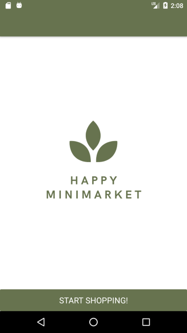
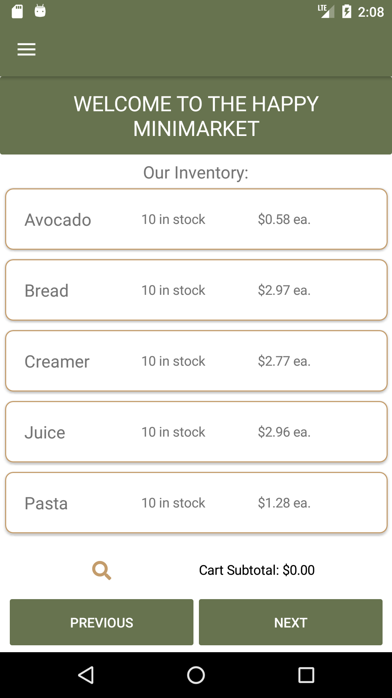
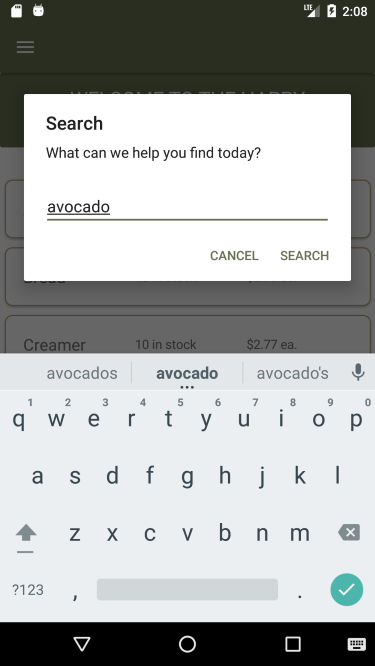
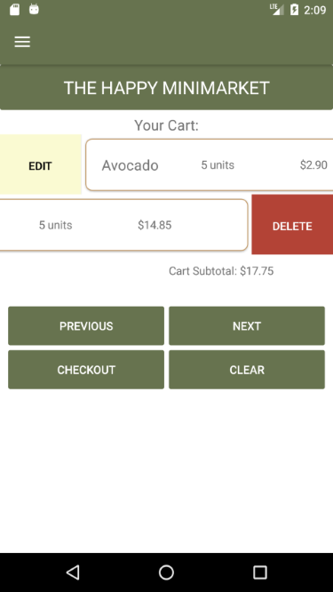
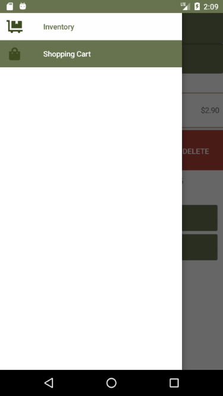
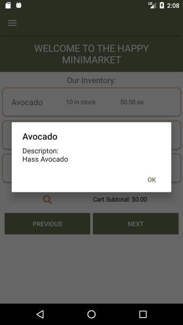
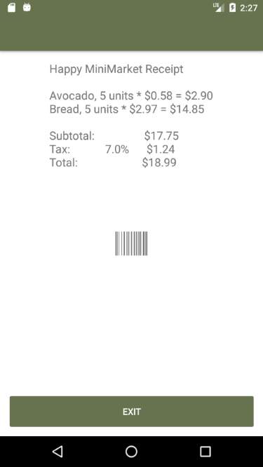

# The Happy MiniMarket
### a mobile shopping application

made for ".NET Development with C#" class, Spring 2021, C. Mills

using Xamarin.Forms and an ASP.NET Core Web API

 

The landing page displays the logo of the store.

The inventory page and shopping cart page are based on similar templates.

 

Search functionality is available for the inventory

The inventory allows the user to swipe to add items to cart, and the shopping cart allows the user to swipe to edit the current quantity in the cart and delete items from the cart and put it back in the inventory

 

Flyout items allow the user to navigate between the two main pages of the app.

Read more detail about an item by clicking on it

Once a user checks out, they can view their receipt which will be saved to the user's local device in case they want to view it again.

*this app has been optimized for Android
