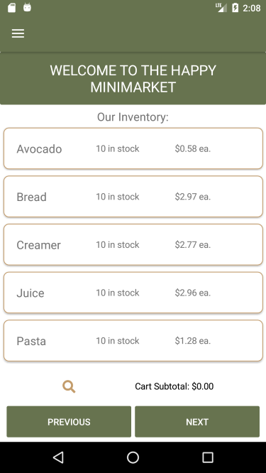

# The Happy MiniMarket
### a mobile shopping application

made for ".Net Development with C#" class, Spring 2021, C. Mills

using Xamarin.Forms and an ASP.NET Core Web Api

 

 

![once a user checks out, they can view their receipt which will be saved to the user's local device in case they want to view it again]

*this app has been optimized for Android
